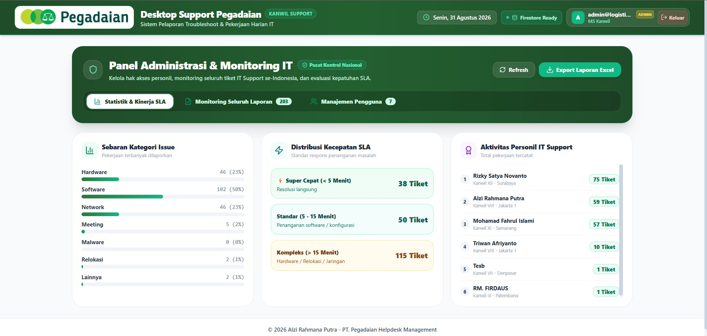
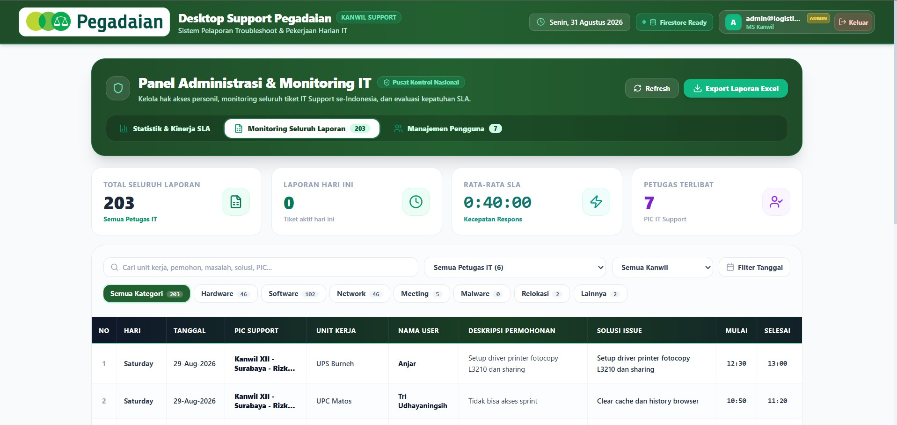
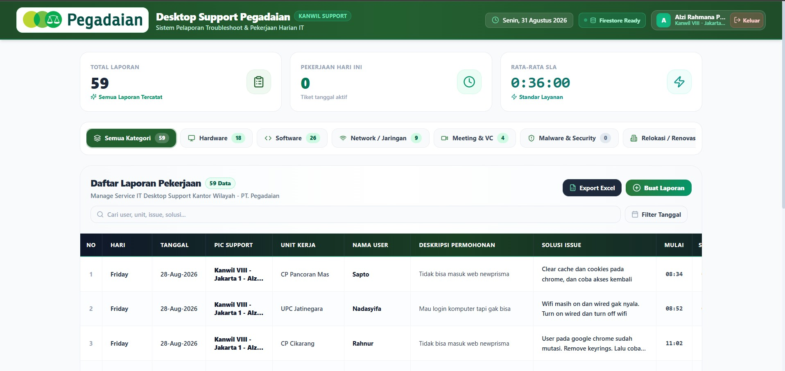
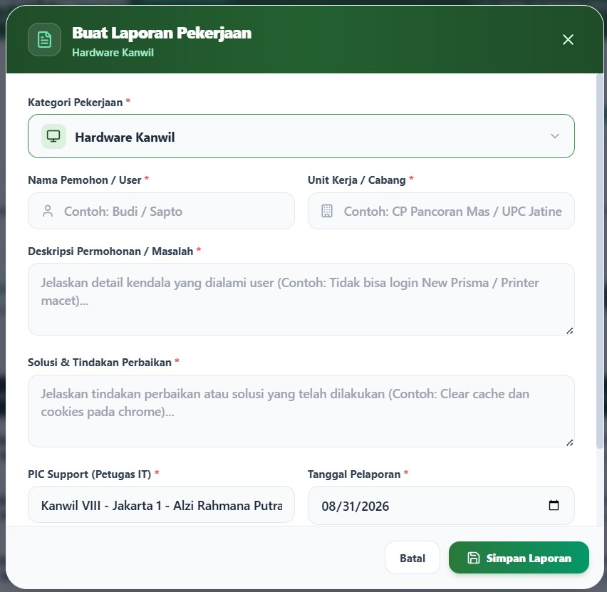

# 🏢 Pegadaian IT Support Daily Reporting & Executive Dashboard

<p align="left">
  
  
  
  
  
  
</p>

Aplikasi Web Pelaporan Pekerjaan Harian & Control Center Monitoring Nasional untuk **Desktop Support PT. Pegadaian**.

Developed with ❤️ by **Alzi Rahmana Putra** © 2026  
🔗 **Live Demo**: [https://laporan-pekerjaan-one.vercel.app/](https://laporan-pekerjaan-one.vercel.app/)

---

## 📸 Tampilan Aplikasi

### 🛡️ Panel Administrator (`/admin`)
| 📊 Statistik & Kinerja SLA | 📋 Monitoring Seluruh Laporan |
| :---: | :---: |
|  |  |

### 💻 Halaman Desktop Support (`/`)
| 📝 Tabel Pekerjaan Harian | ☑️ Tambah Laporan Baru |
| :---: | :---: |
|  |  |

---

## 🌟 Fitur Utama

### 1. 🛡️ Executive Admin Dashboard & Control Center (`/admin`)
Halaman khusus manajemen dan monitoring tingkat eksekutif dengan 3 tab navigasi terpadu:

* **📈 Tab 1: Statistik & Kinerja SLA (Default View)**
  * **Sebaran Kategori Issue**: Visualisasi persentase issue terbanyak (Hardware, Software, Network, Meeting, Malware, Relokasi).
  * **Distribusi Kecepatan SLA**: Pengelompokan respons waktu (*⚡ Super Cepat < 5 Menit*, *Standar 5–15 Menit*, *Kompleks > 15 Menit*).
  * **Leaderboard Personil IT Support**: Peringkat produktivitas petugas IT Support se-Indonesia berdasarkan jumlah tiket yang diselesaikan.
* **📋 Tab 2: Monitoring Seluruh Laporan (Nasional)**
  * **Sinkronisasi Filter 2-Arah**: Memilih Petugas IT Support otomatis menyinkronkan Kanwil, dan memilih Kanwil otomatis menyaring daftar personil di wilayah tersebut.
  * **Dynamic Category Pill Counters**: Angka badge pada tombol kategori (*Hardware, Software, dll.*) otomatis menghitung data secara dinamis mengikuti filter aktif.
  * **Kartu KPI Dinamis**: Total Laporan, Laporan Hari Ini, Rata-Rata Durasi SLA, dan Petugas Terlibat.
  * **Mode Tinjauan Read-Only**: Admin dapat meninjau detail tiket dengan proteksi anti-hapus dan anti-edit.
* **👥 Tab 3: Manajemen Pengguna & Hak Akses**
  * Pengelolaan akun (*Super Admin, Admin, Supervisor, Desktop Support*).
  * Quick Role Changer & Direct Password Reset.
  * Filter pencarian NIK, Nama, Email, Unit Kerja, dan Kantor Wilayah (Kanwil I - XII + Kantor Pusat).
  * Export data master pengguna ke Excel.

---

### 2. 📝 Pelaporan Pekerjaan Harian Desktop Support (`/`)
Halaman kerja harian personil IT Support di lapangan:
* **Input Cepat & Perhitungan Otomatis SLA**:
  * Form input lengkap: `Nama Pemohon`, `Unit Kerja`, `Deskripsi Permohonan`, `Metode Penanganan` (*Visit*, *Remote*, *Guide*), `Solusi Issue`, `Tanggal Pengerjaan`, `Waktu Mulai`, dan `Waktu Selesai`.
  * Durasi pengerjaan / SLA dihitung otomatis dalam format `HH:mm:ss`.
* **Desain Mobile-Friendly & Bottom Sheet**:
  * Form input dengan model Bottom Sheet khusus layar HP dengan tombol sticky `Simpan Laporan`.
  * **Floating Action Button (FAB)** di sudut kanan bawah untuk input cepat.
* **Live Search & Category Filter**:
  * Pencarian instan berdasarkan nama pemohon, solusi, atau unit kerja.
  * Kategori pekerjaan: `Hardware Kanwil`, `Software Kanwil`, `Network / Jaringan`, `Video Conference & Meeting`, `Malware & Security`, `Relokasi / Renovasi`, `Lainnya`.

---

### 3. 🔒 Keamanan Sesi & Running Text Banner
* **⏱️ Auto-Logout Inactivity 30 Menit**:
  * Pemantauan aktivitas pengguna (*mouse movement, keyboard, click, scroll, touch*) di latar belakang secara hening (*silent*).
  * Akun otomatis logout jika tidak ada aktivitas selama 30 menit demi keamanan integritas data laporan.
* **🔄 Multi-Tab Session Synchronization**:
  * Aktivitas di salah satu tab browser otomatis menyinkronkan dan memperpanjang masa aktif sesi di seluruh tab lainnya.
* **📢 Running Text Banner (Marquee Header Bar)**:
  * Terletak tepat di bawah bar navigasi utama.
  * Menampilkan informasi keamanan sesi aktif, identitas personil yang sedang bertugas, dan tips operasional secara real-time.
  * Dilengkapi fitur **Pause on Hover** untuk kenyamanan membaca.

---

### 4. 📊 Export Multi-Sheet Excel Resmi PT. Pegadaian
* **Pilihan Cepat Siklus Cut-Off Laporan**:
  * `[ 21 Lalu - 20 Ini ]` *(Siklus Standar Pegadaian)*
  * `[ 13 Lalu - 12 Ini ]`
  * `[ 1 - Akhir Bln ]` *(Bulan Berjalan)*
  * `[ Hari Ini ]`
  * `[ 7 Hari Terakhir ]`
  * `[ Semua Data ]`
* **Multi-Sheet Workbook Output**:
  * Seluruh kategori otomatis dipecah ke dalam sheet terpisah: `Semua Laporan`, `Hardware Kanwil`, `Software Kanwil`, `Network-Jaringan`, `Video Conference`, `Malware`, `Relokasi-Renovasi`, dan `Lainnya`.
  * Header laporan resmi berstandar korporat PT. Pegadaian lengkap dengan penomoran urut dan ringkasan SLA.
* **Penyaringan Cerdas Sesuai Peran**:
  * Pada halaman `/admin`: Dilengkapi dropdown pemilihan Petugas IT Support dengan live ticket counter.
  * Pada halaman `/`: Disederhanakan untuk langsung mengunduh laporan milik user yang sedang aktif.

---

### 5. 🔐 Autentikasi & Role-Based Access Control (RBAC)
* **Silent Role Guard**:
  * Akun dengan peran **Admin** yang login di `/` otomatis diarahkan (*silent redirect*) ke `/admin`.
  * Akun non-admin yang mencoba mengakses `/admin` otomatis dialihkan ke `/` tanpa memunculkan layar error.
* Sinkronisasi data real-time berbasis Firebase Firestore dengan *fallback* aman ke LocalStorage saat mode offline / tanpa koneksi cloud.

---

## 🚀 Panduan Instalasi & Menjalankan Lokal

### 1. Clone Repositori
```bash
git clone https://github.com/alziputra/Laporan.git
cd Laporan
```

### 2. Install Dependencies
```bash
npm install
```

### 3. Konfigurasi Environment Variable (`.env`)
Buat file `.env` di root direktori project:
```env
NEXT_PUBLIC_FIREBASE_API_KEY=your-api-key-here
NEXT_PUBLIC_FIREBASE_AUTH_DOMAIN=your-auth-domain-here
NEXT_PUBLIC_FIREBASE_PROJECT_ID=your-project-id
NEXT_PUBLIC_FIREBASE_STORAGE_BUCKET=your-storage-bucket
NEXT_PUBLIC_FIREBASE_MESSAGING_SENDER_ID=your-messaging-sender-id
NEXT_PUBLIC_FIREBASE_APP_ID=your-app-id
```

### 4. Jalankan Development Server
```bash
npm run dev
```

Buka browser di:
* Dashboard Petugas IT: [http://localhost:3000](http://localhost:3000)
* Admin Control Center: [http://localhost:3000/admin](http://localhost:3000/admin)

---

## 📚 Dokumentasi Koding & PRD
Dokumentasi teknis lengkap dan spesifikasi produk (PRD) dapat dilihat pada file:
👉 **[DOCUMENTATION.md](./DOCUMENTATION.md)**

---

## 📄 Lisensi & Kontribusi

Dikembangkan khusus untuk mendukung operasional divisi OITI **Kantor Wilayah PT. Pegadaian**.  
Copyright © 2026 **Alzi Rahmana Putra**. All Rights Reserved.
