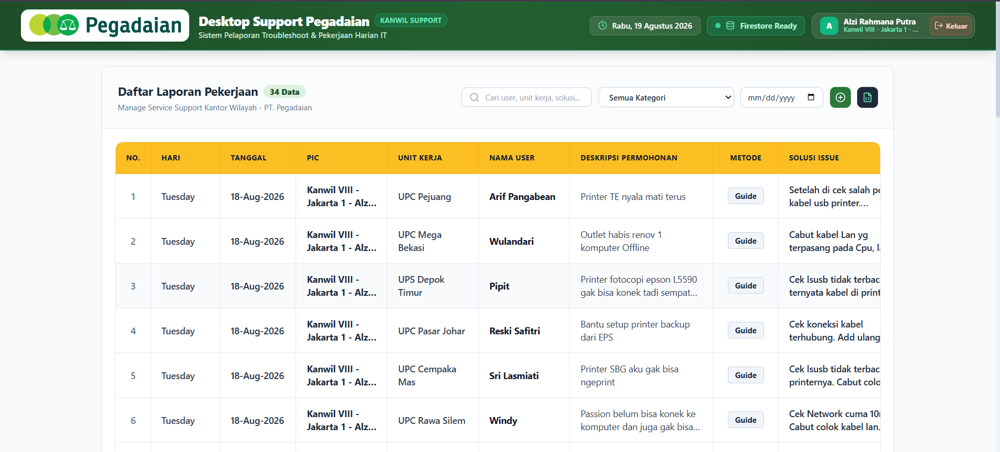

# Desktop Support Pegadaian - Web Pelaporan Pekerjaan Harian

Aplikasi Web Pelaporan Pekerjaan Harian & Troubleshoot Kanwil untuk **Desktop Support Pegadaian**.

Developed by: **Alzi Rahmana Putra** © 2026


Live Demo: https://laporan-pekerjaan-one.vercel.app/

---

## 🌟 Fitur Utama

- **Toolbar Ringkas**: Filter pencarian live, dropdown kategori, filter tanggal, serta tombol ikon **`+ Buat Laporan`** dan **`Export Excel`**.
- **Form Input & Otomatisasi SLA**:
  - Input field: `Nama User`, `Unit Kerja`, `Deskripsi Permohonan`, `Metode Penanganan` (`Guide`, `Visit`, `Remote`), `Solusi Issue`, `PIC Support`, `Tanggal Pelaporan`, `Waktu Mulai`, `Waktu Selesai`.
  - Durasi SLA dihitung otomatis dalam format `HH:mm:ss`.
  - Tampilan Bottom Sheet khusus layar HP dengan tombol sticky `Simpan Laporan`.
- **Export Multi-Sheet Excel (.xlsx)**: Seluruh tab kategori (`Hardware`, `Software`, `Network`, `Meeting`, `Malware`, `Relokasi`, `Lainnya`) dan `Semua Laporan` selalu dibuat otomatis dengan format header resmi PT. Pegadaian.
- **Floating Action Button (FAB)**: Tombol melayang `+ Buat Laporan` di kanan bawah layar HP untuk penginputan cepat.
- **Top-Center Toast**: Notifikasi pop-up di tengah atas layar yang hilang otomatis dalam 2.5 detik.

---

## 🚀 Cara Menjalankan Aplikasi

### 1. Clone Repositori
```bash
git clone https://github.com/alziputra/Laporan.git
```

### 2. Install Dependencies
```bash
npm install
```

### 3. Jalankan Server Development
```bash
npm run dev
```
Akses di browser: [http://localhost:3000](http://localhost:3000)

---

## ⚙️ Konfigurasi Firebase Firestore (`.env`)

```env
NEXT_PUBLIC_FIREBASE_API_KEY=AIzaSy...
NEXT_PUBLIC_FIREBASE_AUTH_DOMAIN=project-anda.firebaseapp.com
NEXT_PUBLIC_FIREBASE_PROJECT_ID=project-anda
NEXT_PUBLIC_FIREBASE_STORAGE_BUCKET=project-anda.appspot.com
NEXT_PUBLIC_FIREBASE_MESSAGING_SENDER_ID=123456789
NEXT_PUBLIC_FIREBASE_APP_ID=1:123456789:web:...
```
